# Kaggle Competitions Handbook

Hướng dẫn toàn diện về quy trình thi đấu Kaggle và sử dụng workspace này.

## Mục Lục

1. [Giới Thiệu Kaggle Competitions](#1-giới-thiệu-kaggle-competitions)
2. [Quy Trình Huấn Luyện Model Chuẩn](#2-quy-trình-huấn-luyện-model-chuẩn)
3. [Kỹ Thuật Nâng Cao](#3-kỹ-thuật-nâng-cao)
4. [Sử Dụng Workspace](#4-sử-dụng-workspace)
5. [Best Practices Theo Môi Trường](#5-best-practices-theo-môi-trường)
6. [Troubleshooting](#6-troubleshooting)

---

## 1. Giới Thiệu Kaggle Competitions

### 1.1 Các Loại Cuộc Thi

**Getting Started (Nhập môn)**
- Không hết hạn, dữ liệu sạch
- VD: Titanic, House Prices
- Mục đích: Học và thực hành

**Playground Series**
- Diễn ra hàng tháng
- Dữ liệu synthetic, bài toán thực tế
- Cộng đồng sôi nổi, nhiều notebooks chia sẻ

**Featured Competitions**
- Bài toán thực tế từ doanh nghiệp
- Có giải thưởng lớn
- Yêu cầu kỹ năng cao

**Research Competitions**
- Tập trung nghiên cứu khoa học
- VD: ARC Prize, AI Mathematical Olympiad

### 1.2 Lộ Trình Học Tập

```mermaid
graph LR
    A[Tuần 1-2: Titanic + House Prices] --> B[Tuần 3-4: Playground Series]
    B --> C[Tháng 2-3: NLP Competitions]
    C --> D[Dài hạn: Featured Competitions]
```



**Giai đoạn 1: Nền tảng (2 tuần)**
- Hoàn thành Titanic và House Prices
- Focus: Xây dựng pipeline chuẩn từ EDA → Model → Submission

**Giai đoạn 2: Thực hành (2 tuần)**
- Tham gia Playground Series hiện tại
- Đọc notebooks top để học EDA và feature engineering

**Giai đoạn 3: Chuyên sâu (2-3 tháng)**
- Chọn 1 lĩnh vực (NLP/CV/Tabular) để đào sâu
- Thử các kỹ thuật nâng cao

**Giai đoạn 4: Thực chiến**
- Tham gia Featured competitions
- Mục tiêu top 10%

---

## 2. Quy Trình Huấn Luyện Model Chuẩn

### 2.1 Cấu Trúc Notebook Chuẩn

Một notebook ML chuẩn gồm 7 phần:

#### **1. Khởi Tạo & Cấu Hình**

```python
class CFG:
    seed = 42                    # Reproducibility
    n_folds = 5                  # Cross-validation
    target_col = 'label'
    model_name = 'xgboost'
    
# Seed everything
def seed_everything(seed):
    np.random.seed(seed)
    random.seed(seed)
    os.environ['PYTHONHASHSEED'] = str(seed)
```

**Tại sao quan trọng:**
- `seed` đảm bảo kết quả tái tạo được
- Config tập trung giúp dễ tune hyperparameters

#### **2. Tiện Ích & Hàm Hỗ Trợ**

```python
def reduce_mem_usage(df):
    """Giảm memory usage của DataFrame"""
    # Downcast int64 -> int32, float64 -> float32
    pass

def plot_feature_importance(model, features):
    """Vẽ feature importance"""
    pass
```

#### **3. EDA (Exploratory Data Analysis)**

```python
# Basic checks
print(df.info())
print(df.describe())

# Missing values
missing = df.isnull().sum()
plt.barh(missing[missing > 0].index, missing[missing > 0].values)

# Target distribution
df[target].value_counts().plot(kind='bar')

# Correlations
sns.heatmap(df.corr(), annot=True)
```

**Checklist EDA:**
- [ ] Kiểm tra shape, dtypes
- [ ] Missing values và outliers
- [ ] Target distribution (imbalanced?)
- [ ] Feature correlations
- [ ] Adversarial validation (train vs test distribution)

#### **4. Feature Engineering**

```python
# Example features
df['FamilySize'] = df['SibSp'] + df['Parch'] + 1
df['Title'] = df['Name'].str.extract(' ([A-Za-z]+)\\.')
df['AgeGroup'] = pd.cut(df['Age'], bins=[0, 12, 18, 35, 60, 100])
```

**Nguyên tắc vàng:**
- Domain knowledge > Complex features
- Bắt đầu đơn giản, thêm dần
- Validate mỗi feature thông qua CV score

#### **5. Modeling Strategy**

```python
# Cross-validation split
from sklearn.model_selection import StratifiedKFold

skf = StratifiedKFold(n_folds=5, shuffle=True, random_state=42)

for fold, (train_idx, val_idx) in enumerate(skf.split(X, y)):
    X_train, X_val = X.iloc[train_idx], X.iloc[val_idx]
    y_train, y_val = y.iloc[train_idx], y.iloc[val_idx]
    
    # Train model
    model.fit(X_train, y_train)
    
    # Validate
    preds = model.predict(X_val)
    score = metric(y_val, preds)
    print(f"Fold {fold}: {score}")
```

**Cross-Validation Strategies:**
- `StratifiedKFold`: Phân loại, đảm bảo tỉ lệ classes
- `GroupKFold`: Data có groups (VD: nhiều ảnh của 1 người)
- `TimeSeriesSplit`: Dữ liệu chuỗi thời gian

#### **6. Training Loop**

```python
oof_preds = np.zeros(len(train))  # Out-of-fold predictions
test_preds = np.zeros(len(test))

for fold in range(CFG.n_folds):
    # Train on fold
    model = train_model(fold)
    
    # OOF predictions
    oof_preds[val_idx] = model.predict(X_val)
    
    # Test predictions
    test_preds += model.predict(X_test) / CFG.n_folds
    
    # Save model
    save_model(model, f'model_fold{fold}.pkl')

# Overall CV score
cv_score = metric(y_train, oof_preds)
print(f"Overall CV: {cv_score}")
```

#### **7. Submission**

```python
submission = pd.DataFrame({
    'id': test_ids,
    'target': test_preds
})
submission.to_csv('submission.csv', index=False)
```

### 2.2 Quy Trình 3 Giai Đoạn

**Giai đoạn 1: Data-Centric (60% thời gian)**
- Hiểu dữ liệu
- Làm sạch
- Feature Engineering

**Giai đoạn 2: Model-Centric (30% thời gian)**
- Chọn CV strategy
- Chọn baseline model
- Tune hyperparameters
- Train & validate

**Giai đoạn 3: Result-Centric (10% thời gian)**
- Error analysis
- Post-processing
- Ensembling

---

## 3. Kỹ Thuật Nâng Cao

### 3.1 Feature Engineering Nâng Cao

#### **Target Encoding**

```python
def target_encode(train, test, col, target, smoothing=10):
    # Tính mean target per category
    means = train.groupby(col)[target].mean()
    global_mean = train[target].mean()
    
    # Smoothing
    counts = train.groupby(col).size()
    smooth_means = (means * counts + global_mean * smoothing) / (counts + smoothing)
    
    # Apply
    train[f'{col}_target_enc'] = train[col].map(smooth_means)
    test[f'{col}_target_enc'] = test[col].map(smooth_means).fillna(global_mean)
```

**Lưu ý:** Target encoding dễ overfit, phải dùng CV properly.

#### **Aggregation Features**

```python
# Group statistics
agg_features = data.groupby('user_id').agg({
    'purchase_amount': ['mean', 'std', 'min', 'max'],
    'purchase_count': 'sum'
}).reset_index()
```

#### **Lag & Rolling Features (Time Series)**

```python
# Lag features
data['sales_lag1'] = data.groupby('store_id')['sales'].shift(1)
data['sales_lag7'] = data.groupby('store_id')['sales'].shift(7)

# Rolling statistics
data['sales_rolling_mean_7d'] = data.groupby('store_id')['sales'].rolling(7).mean().values
```

### 3.2 Ensemble Techniques

#### **Simple Averaging**

```python
# Average predictions from multiple models
final_pred = (pred_xgb + pred_lgbm + pred_catboost) / 3
```

#### **Weighted Averaging**

```python
# Tìm weights tối ưu
from scipy.optimize import minimize

def objective(weights):
    blend = weights[0]*pred1 + weights[1]*pred2 + weights[2]*pred3
    return -metric(y_true, blend)

result = minimize(objective, [0.33, 0.33, 0.34], bounds=[(0,1)]*3)
optimal_weights = result.x
```

#### **Stacking**

```python
# Level 1: Base models
base_models = [XGBoost(), LightGBM(), CatBoost()]
level1_train = np.zeros((len(train), len(base_models)))

for i, model in enumerate(base_models):
    oof_preds = cross_val_predict(model, X_train, y_train, cv=5)
    level1_train[:, i] = oof_preds

# Level 2: Meta model
meta_model = LogisticRegression()
meta_model.fit(level1_train, y_train)
```

### 3.3 Hyperparameter Tuning với Optuna

```python
import optuna

def objective(trial):
    params = {
        'max_depth': trial.suggest_int('max_depth', 3, 10),
        'learning_rate': trial.suggest_float('learning_rate', 0.01, 0.3),
        'n_estimators': trial.suggest_int('n_estimators', 100, 1000)
    }
    
    model = XGBClassifier(**params)
    score = cross_val_score(model, X, y, cv=5).mean()
    return score

study = optuna.create_study(direction='maximize')
study.optimize(objective, n_trials=100)

print(f"Best params: {study.best_params}")
```

### 3.4 Kỹ Thuật Xử Lý Dữ Liệu

#### **Adversarial Validation**

```python
# Gộp train và test
train['is_test'] = 0
test['is_test'] = 1
combined = pd.concat([train, test])

# Train classifier phân biệt train vs test
X = combined.drop(['target', 'is_test'], axis=1)
y = combined['is_test']

model = RandomForestClassifier()
auc = cross_val_score(model, X, y, scoring='roc_auc', cv=5).mean()

print(f"AUC: {auc}")
# Nếu AUC > 0.8: Train và Test khác nhau nhiều
# Nếu AUC ~ 0.5: Train và Test giống nhau
```

#### **Pseudo-Labeling**

```python
# Train model lần 1
model.fit(X_train, y_train)

# Predict test
test_probs = model.predict_proba(X_test)

# Lấy samples có high confidence
confident_idx = (test_probs.max(axis=1) > 0.95)
pseudo_X = X_test[confident_idx]
pseudo_y = test_probs[confident_idx].argmax(axis=1)

# Gộp vào train và train lại
X_extended = pd.concat([X_train, pseudo_X])
y_extended = pd.concat([y_train, pd.Series(pseudo_y)])

model.fit(X_extended, y_extended)
```

---

## 4. Sử Dụng Workspace

### 4.1 Setup Local

#### **Bước 1: Tạo Environment**

```bash
# Clone repo
git clone https://github.com/n24q02m/n24q02m-kaggle-competitions.git
cd n24q02m-kaggle-competitions

# Tạo conda env
conda env create -f environment.yml

# Activate
conda activate kaggle-competitions
```

#### **Bước 2: Setup Kaggle API**

```bash
# Download credentials từ Kaggle → Account → API → Create New Token
# Di chuyển kaggle.json vào ~/.kaggle/
mkdir -p ~/.kaggle
mv ~/Downloads/kaggle.json ~/.kaggle/
chmod 600 ~/.kaggle/kaggle.json
```

#### **Bước 3: Download Competition Data**

```bash
# Download Titanic data
kaggle competitions download -c titanic -p competitions/titanic/data

# Unzip
cd competitions/titanic/data
unzip titanic.zip
rm titanic.zip
```

#### **Bước 4: Mở Notebook trong VS Code**

```bash
# Mở VS Code
code .

# Trong VS Code:
# 1. Chọn kernel: kaggle-competitions
# 2. Mở file: competitions/titanic/notebooks/solution.ipynb
# 3. Bắt đầu code!
```

### 4.2 Setup Google Colab

**Bước 1: Upload Notebook**
- Upload `solution.ipynb` lên Colab
- Hoặc: File → Upload notebook → GitHub URL

**Bước 2: Chạy Bootstrap Cell**
- Cell đầu tiên sẽ tự động:
  - Mount Google Drive (nếu cần)
  - Download `setup_env.py` từ GitHub
  - Cài requirements

**Bước 3: Upload Data**
```python
from google.colab import files
uploaded = files.upload()  # Upload train.csv, test.csv
```

Hoặc mount Drive và dùng data từ Drive.

### 4.3 Setup Kaggle Kernels

**Bước 1: Create Notebook**
- Kaggle → Competitions → Titanic → Code → New Notebook

**Bước 2: Copy Bootstrap Cell**
- Copy bootstrap cell từ template
- Thay đổi paths để dùng `/kaggle/input/titanic`

**Bước 3: Code!**
- Data đã sẵn tại `/kaggle/input/titanic/`
- Không cần download

### 4.4 Workflow Bắt Đầu Cuộc Thi Mới

```bash
# 1. Tạo structure
mkdir -p competitions/new-competition/{data,notebooks,models,submissions}

# 2. Copy template
cp competitions/titanic/notebooks/solution.ipynb \\
   competitions/new-competition/notebooks/

# 3. Download data
kaggle competitions download -c new-competition \\
  -p competitions/new-competition/data

# 4. Update notebook paths và code!
```

---

## 5. Best Practices Theo Môi Trường

### 5.1 Local Development

**Ưu điểm:**
- Full control
- Dùng được GPU cá nhân
- Không bị giới hạn thời gian
- Code versioning dễ dàng

**Best Practices:**
- ✅ Luôn dùng conda environment riêng
- ✅ Commit code thường xuyên (Git)
- ✅ Track experiments (MLflow, Weights & Biases)
- ✅ Save models với versioning (`model_v1_cv0.85.pkl`)

**Checklist:**
- [ ] Activated conda env
- [ ] Git commit sau mỗi experiment
- [ ] Model và results được save
- [ ] Notebooks có markdown giải thích

### 5.2 Google Colab

**Ưu điểm:**
- Miễn phí GPU/TPU
- Không cần setup máy
- Dễ chia sẻ

**Nhược điểm:**
- Timeout sau 12h
- Mất data khi disconnect
- RAM giới hạn

**Best Practices:**
- ✅ Lưu checkpoints thường xuyên vào Drive
- ✅ Dùng `%%time` để track thời gian cells
- ✅ Clear output không cần thiết (tiết kiệm RAM)
- ⚠️ Mount Drive ngay đầu session

**Tricks:**
```python
# Auto-reconnect (chống disconnect)
function ClickConnect(){
  console.log("Working");
  document.querySelector("colab-toolbar-button#connect").click()
}
setInterval(ClickConnect,60000)
```

### 5.3 Kaggle Kernels

**Ưu điểm:**
- Data có sẵn
- Share code dễ dàng
- Điểm cộng cho leaderboard

**Nhược điểm:**
- 9h/week GPU quota
- Internet off trong competition

**Best Practices:**
- ✅ Develop locally, test trên Kaggle
- ✅ Dùng Kaggle Datasets cho external data
- ✅ Enable GPU chỉ khi cần
- ✅ Comment code rõ ràng (cho community)

---

## 6. Troubleshooting

### 6.1 Common Issues

#### **"Module not found" trên Colab/Kaggle**

```python
# Option 1: Install thiếu package
!pip install -q package-name

# Option 2: Check import path
import sys
print(sys.path)
```

#### **"Out of Memory" error**

```python
# Giảm batch size
CFG.batch_size = 16  # thay vì 32

# Clear memory
import gc
del large_variable
gc.collect()

# Dùng dtype nhẹ hơn
df = df.astype('float32')  # thay vì float64
```

#### **CV score tốt nhưng LB score kém**

**Nguyên nhân:**
- Overfitting validation set
- Train/Test distribution khác nhau
- Data leakage

**Giải pháp:**
- Kiểm tra Adversarial Validation
- Thêm regularization
- Kiểm tra lại feature engineering

#### **Bootstrap cell failed trên Colab**

```python
# Check internet connection
!ping -c 3 raw.githubusercontent.com

# Check GitHub URL
CORE_URL = f"https://raw.githubusercontent.com/{GITHUB_USER}/{REPO_NAME}/{BRANCH}/core"
print(CORE_URL)

# Manual download
!wget {CORE_URL}/setup_env.py
```

### 6.2 Performance Tips

#### **Speed up pandas operations**

```python
# Dùng category dtype cho categorical cols
df['category_col'] = df['category_col'].astype('category')

# Vectorize thay vì apply
df['new_col'] = df['col1'] + df['col2']  # Fast
# df['new_col'] = df.apply(lambda x: x['col1'] + x['col2'], axis=1)  # Slow
```

#### **Speed up model training**

```python
# XGBoost: early stopping
model.fit(X_train, y_train,
          eval_set=[(X_val, y_val)],
          early_stopping_rounds=50,
          verbose=False)

# Dùng GPU
XGBClassifier(tree_method='gpu_hist')
```

### 6.3 Debugging Tips

```python
# Print shapes thường xuyên
print(f"Train: {X_train.shape}, Test: {X_test.shape}")

# Check for NaN
assert not df.isnull().any().any(), "Found NaN values!"

# Validate predictions
assert len(predictions) == len(test), "Prediction length mismatch!"
assert predictions.min() >= 0 and predictions.max() <= 1, "Invalid probability!"
```

---

## Tài Nguyên Tham Khảo

### Học Tập
- [Kaggle Learn](https://www.kaggle.com/learn)
- [Fast.ai Courses](https://www.fast.ai/)
- [Coursera ML Specialization](https://www.coursera.org/specializations/machine-learning-introduction)

### Tools
- [Optuna Documentation](https://optuna.readthedocs.io/)
- [XGBoost Documentation](https://xgboost.readthedocs.io/)
- [Scikit-learn Documentation](https://scikit-learn.org/)

### Community
- [Kaggle Forums](https://www.kaggle.com/discussion)
- [Reddit r/MachineLearning](https://www.reddit.com/r/MachineLearning/)

---

**Happy Kaggling! 🚀**
